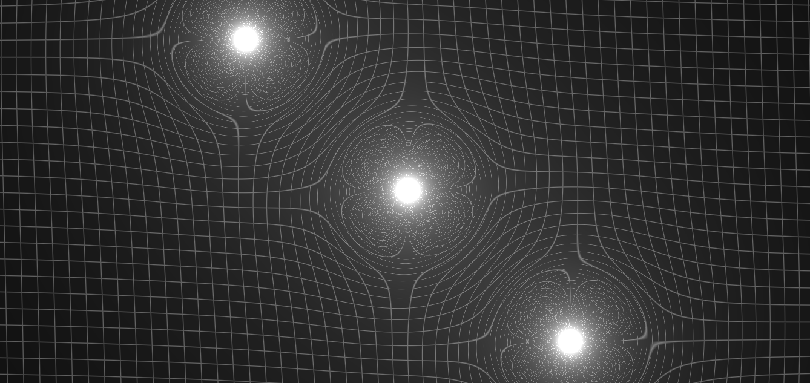

<h2 align="center">Planets go brrrrr.</h2>

I simply modified a project that i have in 2020 to render a grid that is modified by gravity... it can be described in a simple way.

## :star: Wtf is this? 
A simple webgl application to (probably in a wrong way) simulate the distortion that the gravity makes in the space....

## How it works?
It is a simple a WebGL application that in the fragment shader i calculate the distortion caused by the stars. So.. the all the pixels in the screen are affected by the local gravity and then with the fraction part of the modified position we can calculate a grid. 

## This have some bad code
I'll rewrite it.. i just modified some simple game engine that i learned to make by a github repository in 2020 to render some planets.

